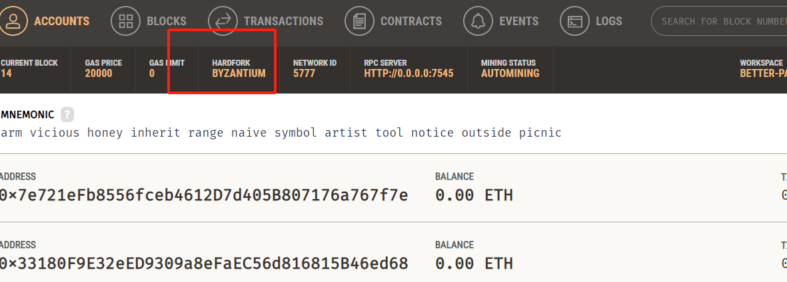
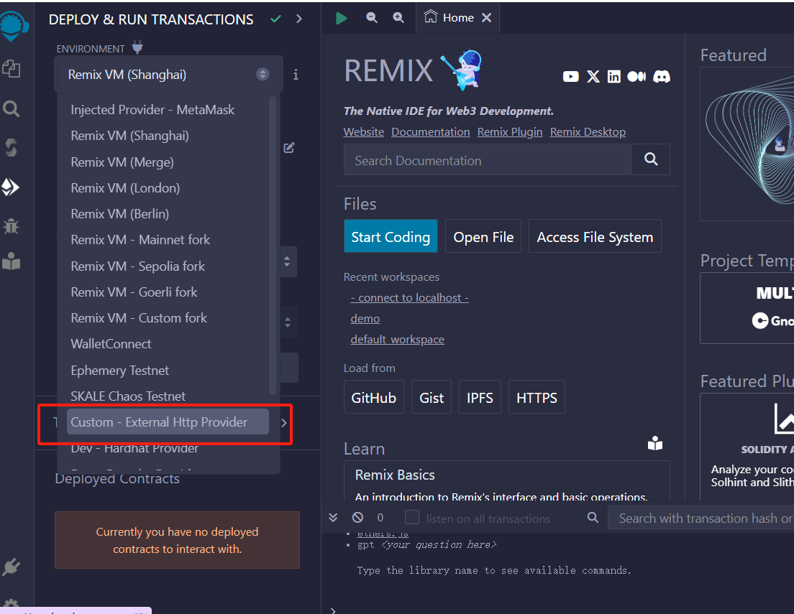
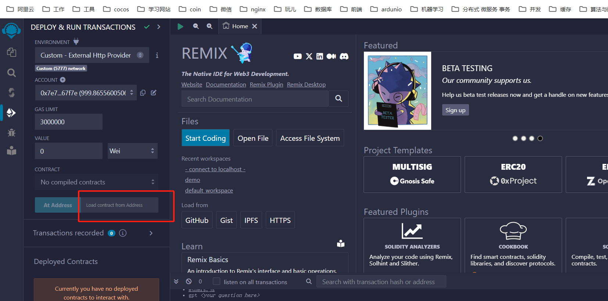

## truffle + ganache 部署私链 + 合约部署

#### 准备
  * 下载[ganache](https://archive.trufflesuite.com/ganache/)
  * 安装 truffle
    ```shell
      npm i -g truffle
    ```
  * 启动 ganache

#### 项目准备
  * 初始化项目
  ```shell
    cd ../code && mkdir truffle_example && cd truffle_example
    truffle init
  ```

  * 配置truffle
    * truffle-config.js

    ```js
    // 声明网络配置
    networks: {
    development: {
        host: "127.0.0.1",
        port: 7545,
    	  network_id: "5777",
    		gas: 6721975,  
        gasPrice: 20000000000,
        //如有必要，可以设置
        from: "0x33180F9E32eED9309a8eFaEC56d816815B46ed68"
      },
    }
      // 声明编译配置
      compilers: {
        solc: {
          version: "0.8.20",     
    	    evmVersion: "byzantium"
        }
      }
    ```

    * 注意`evmVersion`要与`ganache`里面的hardfork保持一致
    

  * 在`migrations/`下配置migration:  [1_test_migration.js](../code/1_test_migration.js)
    * 注意命名必须以数字开头，按照名称正序执行
  ```js
    // RmcErc20 是sol文件内的合约名称
    const Payable = artifacts.require("RmcErc20");
    module.exports = function (deployer) {
    	const name = "RaymooonnToken";
    	const symbol = "RMT";
    	const amount = 1000;
      //  Payable 是合约的实体
      // 后面这三个是合约自定义的构造器的入参
    	deployer.deploy(Payable,name,symbol,amount);
    };
  ```

#### 合约部署

##### 外链合约处理

  * 如果sol文件引用了外链的文件，比如
  ```solidity
    import "https://github.com/OpenZeppelin/openzeppelin-contracts/blob/v5.0.1/contracts/token/ERC20/ERC20.sol";
  ```

  * 需要进行依赖包下载，并转换成
  ```solidity
    import "@openzeppelin/contracts/token/ERC20/ERC20.sol";
  ```
  * 然后执行
  ```shell
    npm install @openzeppelin/contracts
  ```

##### 部署
  * truffle compile 编译
  * truffle migrate 成功即可获取address

#### 验证

* remix 验证
  * 连接私链网络
    
  * 编译一遍相同的合约文件
  * 获取truffle部署的contract，输入链上的合约地址并执行，成功的话，可以验证合约的功能了
    

* 代码验证
